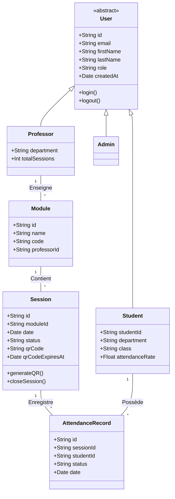
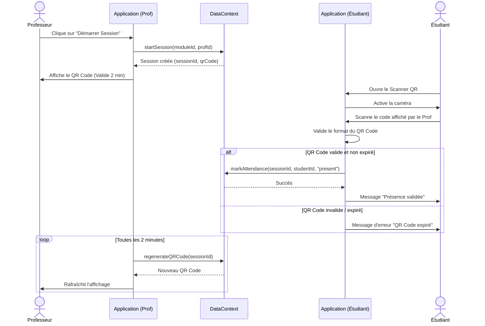
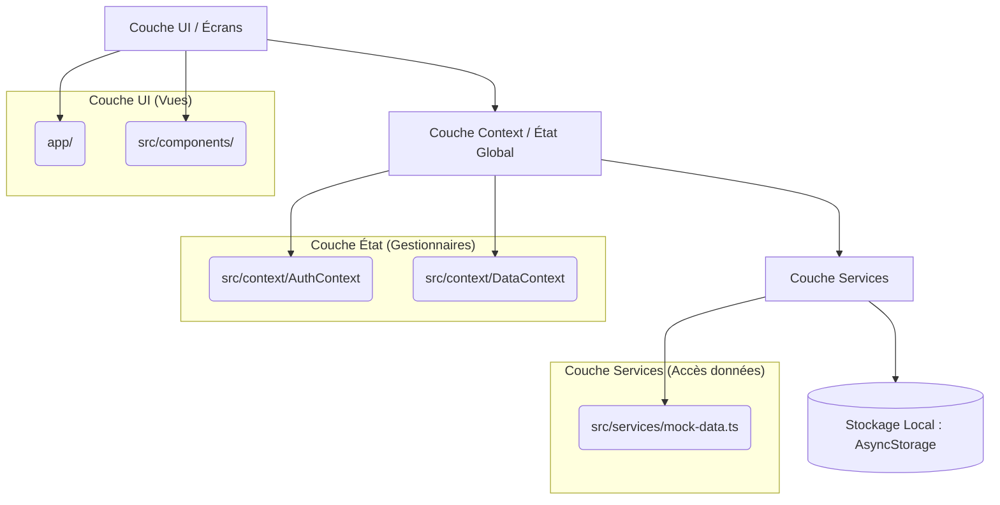

# Diagrammes UML - SB Smart Attendance

Ce document présente les diagrammes UML modélisant l'application de gestion des présences. Ces diagrammes permettent de visualiser la structure, les interactions et le comportement du système.

*Note : Les diagrammes utilisent la syntaxe Mermaid qui est rendue nativement par GitHub.*

## 1. Diagramme des Cas d'Utilisation

Ce diagramme illustre les interactions possibles entre les différents types d'utilisateurs (acteurs) et le système.

```mermaid
usecaseDiagram
    actor Étudiant as student
    actor Professeur as prof
    actor Administrateur as admin

    package "SB Smart Attendance" {
        usecase "S'authentifier" as UC1
        usecase "Consulter les statistiques" as UC2
        
        usecase "Scanner un QR Code" as UC3
        usecase "Consulter l'historique" as UC4
        
        usecase "Créer une session" as UC5
        usecase "Générer QR Code" as UC6
        usecase "Clôturer la session" as UC7
        
        usecase "Gérer les étudiants" as UC8
        usecase "Gérer les professeurs" as UC9
        usecase "Gérer les modules" as UC10
    }

    student --> UC1
    prof --> UC1
    admin --> UC1

    student --> UC2
    prof --> UC2
    admin --> UC2

    student --> UC3
    student --> UC4

    prof --> UC5
    prof --> UC6
    prof --> UC7
    UC5 ..> UC6 : <<include>>

    admin --> UC8
    admin --> UC9
    admin --> UC10
```

## 2. Diagramme de Classes

Modélisation des entités de données manipulées par l'application et de leurs relations.



## 3. Diagramme de Séquence (Prise de Présence)

Ce diagramme décrit chronologiquement le processus de validation de la présence : de la génération du QR code par le professeur au scan par l'étudiant.



## 4. Architecture de l'Application Modèle Vue

Bien qu'il s'agisse d'une application frontend React Native, l'architecture respecte une séparation des responsabilités.


